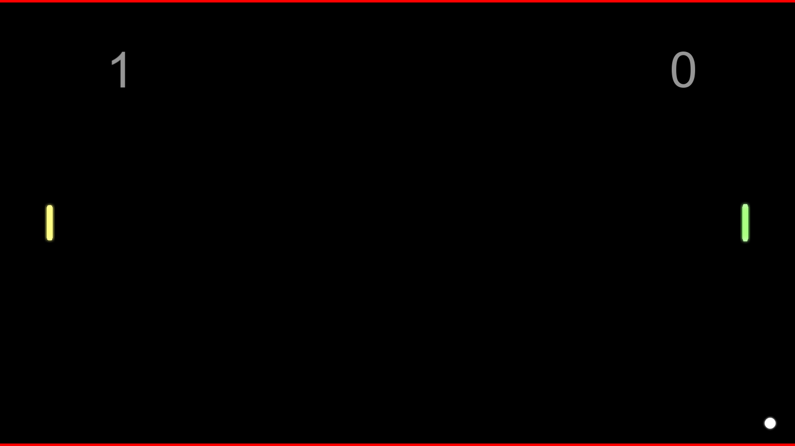

# Pong (July 2015)
Two Player Pong game developed in C++ with SFML

## Project Description

Two Player Pong game. Players control their pallets in order to prevent the ball from falling in their side and reflecting it back to the opposing side. First player to 5 points wins.

Slow-motion powerup: Ball speeds gradually slows down to almost 0 velocity and then immediately speeds up:

## Usage

* Press Enter to Restart
* Use W for up and S for down for the first player
* Use ArrowUp and ArrowDown for the second player
* Press Space for slow-motion power-up effect.
